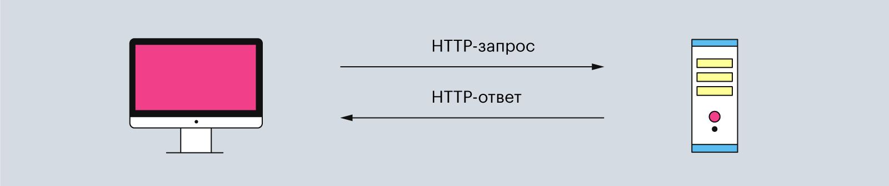
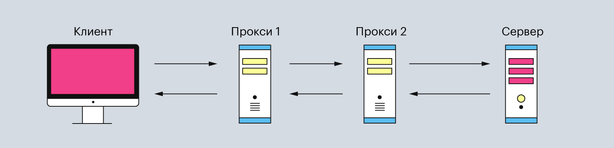
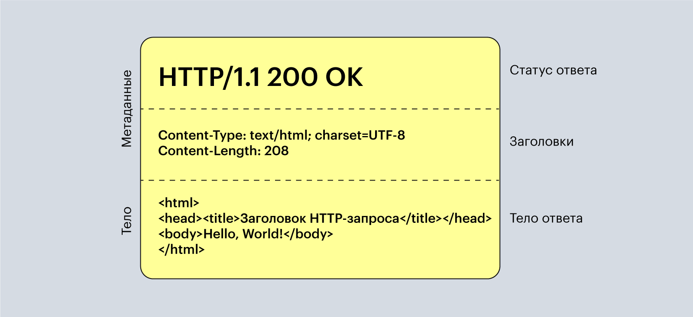

# HTTP
**HTTP** (*HyperText Transfer Protocol*) - «протокол передачи гипертекста»

Он представляет собой список правил, по которым компьютеры обмениваются данными в интернете. HTTP умеет передавать все возможные форматы файлов — например, видео, аудио, текст. Но при этом состоит только из текста.

Протокол HTTP предполагает использование клиент-серверной структуры передачи данных. Клиентское приложение формирует запрос и отправляет его на сервер, после чего серверное программное обеспечение обрабатывает данный запрос, формирует ответ и передаёт его обратно клиенту. После этого клиентское приложение может продолжить отправлять другие запросы, которые будут обработаны аналогичным образом.

## Из чего состоит HTTP
HTTP состоит из двух элементов: клиента и сервера. Клиент отправляет запросы и ждёт данные от сервера. А сервер ждёт, пока ему придёт очередной запрос, обрабатывает его и возвращает ответ клиенту.

Обычно эта связь между клиентом и сервером имеет посредников в виде прокси-серверов. Они нужны для разных операций — например, для безопасности и конфиденциальности, кэширования или распределения нагрузки на серверы.

Поэтому типичная процедура отправки HTTP-запроса от клиента выглядит так:

**Клиентом** может быть любое устройство, через которое пользователь запрашивает данные. Часто в роли клиента выступает веб-браузер, программы для отладки приложений или даже командная строка. Главная особенность клиента — он всегда инициирует запрос.

**Сервер** — это устройство, которое обрабатывает запросы клиента. Он может состоять как из одного компьютера, так и из кластера. А ещё несколько виртуальных серверов могут находиться на одной физической машине.

**Прокси-серверы** — это второстепенные серверы, которые располагаются между клиентом и главным сервером. Они обрабатывают HTTP-запросы, а также ответы на них. Чаще всего прокси-серверы используют для кэширования и сжатия данных, обхода ограничений и анонимных запросов. И ещё — обычно между клиентом и основным сервером находится один или несколько таких прокси-серверов.

## Как HTTP-протокол работает

Весь процесс передачи HTTP-запроса можно разбить на пять шагов. Давайте разберём их подробнее.

### Шаг первый — вписываем URL в браузер
Чтобы отправить HTTP-запрос, нужно использовать URL-адрес — это «унифицированный указатель ресурса» (или Uniform Resource Locator). Он указывает браузеру, что нужно использовать HTTP-протокол, а затем получить файл с этого адреса обратно. Обычно URL-адреса начинаются с http:// или https:// (зависит от версии протокола).

### Шаг второй — браузер находит IP-адрес
Для пользователей URL-адрес — это набор понятных слов: YouTube, Yandex, Google. Но для компьютера эти понятные нам слова — набор непонятных символов.

Поэтому браузер отправляет введённые вами слова в DNS, преобразователь URL-адресов в IP-адреса. DNS расшифровывается как «доменная система имён» (Domain Name System), и его можно представить как огромную таблицу со всеми зарегистрированными именами для сайтов и их IP-адресами.

### Шаг третий — браузер отправляет HTTP-запрос
DNS возвращает браузеру IP-адрес, с которым тот уже умеет работать. Теперь браузер начинает составлять HTTP-запрос с вложенным в него IP-адресом.
Сам HTTP-запрос может выглядеть так:
GET / HTTP/1.1
Host: www.youtube.com
Здесь четыре элемента: метод — «GET», URI — «/», версия HTTP — «1.1» и адрес хоста — «www.youtube.com». Давайте разберём каждый из них подробнее.

**Метод** — это действие, которое клиент ждёт от сервера. Например, отправить ему HTML-страницу сайта или скачать документ. Протокол HTTP не ограничивает количество разных методов, но программисты договорились между собой использовать только три основных:

**GET** — чтобы получить данные с сервера. Например, видео с YouTube или мем с Reddit.
**POST** — чтобы отправить данные на сервер. Например, сообщение в Telegram или новый трек в SoundCloud.
**HEAD** — чтобы получить только метаданные об HTML-странице сайта. Это те данные, которые находятся в \<head\>-теге HTML-файла.

**URI** расшифровывается как «унифицированный идентификатор ресурса» (или Uniform Resource Identifier) — это полный адрес сайта в Сети. Он состоит из двух частей: URL и URN. Первое — это адрес хоста. Например, www.youtube.com или www.vk.com. Второе — это то, что ставится после URL и символа / — например, для URI www.vk.com/feed URN-адресом будет /feed. URN ещё можно назвать адресом до конкретного файла на сайте.

**Версия HTTP** указывает, какую версию HTTP браузер использует при отправке запроса. Если её не указывать, по умолчанию будет стоять версия 1.1. Она нужна, чтобы сервер вернул HTTP-ответ с той же версией HTTP-протокола и не создал ошибок с чтением у клиента.

**Адрес хоста** нужен, чтобы указать, с какого сайта клиент пытается получить данные. Адрес указывают в виде домена, но он сразу же меняется на IP-адрес перед отправкой запроса с помощью DNS.

### Шаг четвёртый — сервер отдаёт HTTP-ответ
После получения и обработки HTTP-запроса сервер создаёт ответ и отправляет его обратно клиенту. В нём содержатся дополнительная информация (метаданные) и запрашиваемые данные.

Простой HTTP-ответ выглядит так:
HTTP/1.1 200 OK
Content-Type: text/html; charset=UTF-8
Content-Length: 208

\<html\>
\<head\>
\<title\>Заголовок HTTP-запроса\<title\>
\<head\>
\<body\>Hello World\<body\>
\<html\>

Здесь три главные части: статус ответа — **HTTP/1.1 200 OK**, заголовки **Content-Type** и **Content-Length** и тело ответа — **HTML-код**. Рассмотрим их подробнее.

**Статус ответа** содержит версию HTTP-протокола, который клиент указал в HTTP-запросе. А после неё идёт код статуса ответа — 200, что означает успешное получение данных. Затем — словесное описание статуса ответа: «ок».

Всего статусов в спецификации HTTP 1.1 — 40. Вот самые популярные из них:

- 200 OK — данные успешно получены;
- 201 Created — значит, что запрос успешный, а данные созданы. Его используют, чтобы подтверждать успех запросов PUT или POST;
- 300 Moved Permanently — указывает, что URL-адрес изменили навсегда;
- 400 Bad Request — означает неверно сформированный запрос. Обычно это случается в связке с запросами POST и PUT, когда данные не прошли проверку или представлены в неправильном формате;
- 401 Unauthorized — нужно выполнить аутентификацию перед тем, как запрашивать доступ к ресурсу;
- 404 Not Found — значит, что не удалось найти запрашиваемый ресурс;
- 405 Forbidden — говорит, что указанный метод HTTP не поддерживается для запрашиваемого ресурса;
- 409 Conflict — произошёл конфликт. Например, когда клиент хочет создать дважды данные с помощью запроса PUT;
- 500 Internal Server Error — означает ошибку со стороны сервера.

**Заголовки** помогают браузеру разобраться с полученными данными и представить их в правильном виде. Например, заголовок **Content-Type** сообщает, какой формат файла пришёл и какие у него дополнительные параметры, а **Content-Length** — сколько места в байтах занимает этот файл.

**Тело ответа** содержит в себе сам файл. Например, сервер может вернуть код HTML-документа или отправить JPEG-картинку.

### Шаг пятый — браузер отображает веб-страницу
Как только браузер получил ответ с веб-страницей, он отображает её с помощью внутреннего движка. И на этом весь процесс отправки и получение HTTP-запросов заканчивается, а клиент получает нужные ему данные.